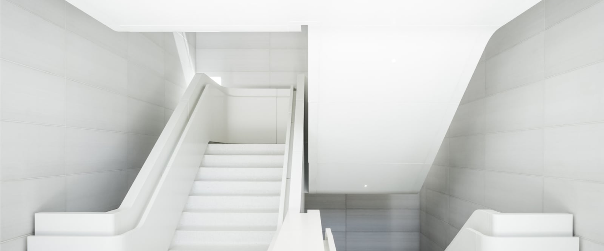
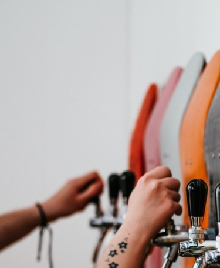

<!DOCTYPE html>
<html lang="en">
<head>
    <meta charset="UTF-8">
    <meta http-equiv="X-UA-Compatible" content="IE=edge">
    <meta name="viewport" content="width=device-width, initial-scale=1.0">
    <title>Wishbone</title>
    
    <!-- Poppins Font-->
    <link rel="preconnect" href="https://fonts.googleapis.com">
    <link rel="preconnect" href="https://fonts.gstatic.com" crossorigin>
    <link href="https://fonts.googleapis.com/css2?family=Poppins&display=swap" rel="stylesheet">
    <!----------------->

    <link rel="stylesheet" href="css/style.css">
</head>
<body>
    

        <header class="header">
            

                

                    
                

                <nav class="header__menu menu">
                    <ul class="menu__list">
                        <li><a href="#" class="menu__link">Projects</a></li>
                        <li><a href="#" class="menu__link">About</a></li>
                        <li><a href="#" class="menu__link">News</a></li>
                        <li><a href="#" class="menu__link">Team</a></li>
                        <li><a href="#" class="menu__link">Contact</a></li>
                        <li><a href="#" class="menu__link menu__btn">Get template</a></li>
                    </ul>
                </nav>
                

                    
                    
                    
                

            

        </header>
        

            

                

                    
Wishbone+Partners

                

                

                    <h1 class="main-form__title">The home of beautiful architecture.</h1>
                

                

                    
We are an architecture firm with a focus on beautiful but functional design. At its heart, we believe design is about usability and accessibility — these are the guiding principles for our work. Read more about our previous projects, our process and our team below.

                

                

                    <a href="#" class="main-form__link">Read more</a>
                

            

            

                
            

        

        

            

                

                    

                        <h2 class="firm__title">Our firm</h2>
                    

                    

                        
Lorem ipsum dolor sit amet, consectetur adipiscing elit. Suspendisse varius enim in eros elementum tristique. Duis cursus, mi quis viverra ornare, eros dolor interdum nulla, ut commodo diam libero vitae erat. Aenean faucibus nibh et justo cursus id rutrum lorem imperdiet. Nunc ut sem vitae risus tristique posuere.

                        
Lorem ipsum dolor sit amet, consectetur adipiscing elit. Suspendisse varius enim in eros elementum tristique. Duis cursus, mi quis viverra ornare, eros dolor interdum nulla, ut commodo diam libero vitae erat. Aenean faucibus nibh et justo cursus id rutrum lorem imperdiet. Nunc ut sem vitae risus tristique posuere.

                        
Lorem ipsum dolor sit amet, consectetur adipiscing elit. Suspendisse varius enim in eros elementum tristique. Duis cursus, mi quis viverra ornare, eros dolor interdum nulla, ut commodo diam libero vitae erat. Aenean faucibus nibh et justo cursus id rutrum lorem imperdiet. Nunc ut sem vitae risus tristique posuere.

                        

                            
                            

                                
Stephen Collier

                                
Senior Partner

                        

                        

                    

                

            
  
            <section class="review">
                
Reeding house

                

                    

                    
Reeding House

                    
Lorem ipsum dolor sit amet, dolor sit amet dolor sit amet.

                    

                

                
            </section>
            

                

                    

                        

                            
Our process

                            
How we do what we do.

                        

                        

                            

                                
                                
Sketching

                                
Lorem ipsum dolor sit amet, consectetur adipiscing elit. Nulla ut tristique libero. Nulla luctus sapien ac arcu tempor, vitae tempor leo iaculis.

                            

                            

                                
                                
Finalizing

                                
Adipiscing elit. Nulla ut tristique libero. Nulla vitae tempor leo iaculis luctus sapien ac arcu tempor, vitae.

                            

                            

                                
                                
Building

                                
Nulla ut tristique libero. Lorem ipsum ut tristique libero. Nulla luctus sapien ac arcu tempor, vitae lorem ipsum dolor leo iaculis.

                            

                        

                    

                

            

            <section class="review">
                
The marble staircase

                

                    

                    
The marble staircase

                    
Lorem ipsum dolor sit amet, dolor sit amet dolor sit amet.

                    

                

                
            </section>
            

                

                    

                        
prior clients

                        
Happy customers.

                        
Morbi neque ex, condimentum dapibus congue et, vulputate ut ligula. Vestibulum sit amet urna turpis. Mauris euismod elit et nisi ultrices, ut faucibus orci tincidunt.   

                    

                    

                          
                          
                          
                          
                    
                      
                

            

            

                

                    

                        
Featured projects

                        
Some of the latest and greatest projects from us here at Wishbone+Partners.

                    

                    

                        
                        
                        
                    

                    

                        <a href="#">View all projects</a>
                    

                

            

            

                

                    

                        
Meet our team

                        
Lorem ipsum dolor sit amet, consectetur adipiscing elit. Suspendisse varius enim in eros elementum tristique. Duis cursus, mi quis.

                        <a href="#" class="team__link">See team</a>
                    

                    

                        

                            
                           

                            
Stephen Collier

                            
Senior Partner

                           
 
                        

                        

                            
                            

                                
Nolan Peters

                                
Associate

                            

                        

                        

                            
                            
 
                                
Ferris Wonder

                                
Associate Partner

                            

                        

                        

                            
                            

                                
Aria Stone

                                
Senior Partner

                            

                        

                        

                            
                            

                                
Niko Ferry

                                
Partner

                            

                        

                    

                

            

            

                

                    

                        
Get in touch

                        
Think we would be a good fit for your next project?

                    

                    

                        <a href="#">Get in touch</a>
                    

                

            

        

        <footer class="footer">
            

                

                    
                    
Powered by Webflow

                    
All rights reserved Wishbone+Partners, Inc.Licensing

                

                

                    
                    
                    
                

            

        </footer>
    

</body>
</html>
